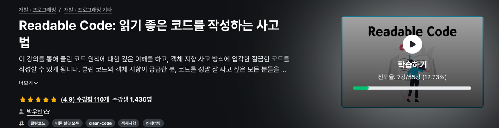

# clean-readable-code

이 저장소는 [읽기 좋은 코드를 작성하는 방법](https://github.com/wbluke/readable-code/tree/main) 인프런 강의 예제를 학습하며 실습한 개인 프로젝트입니다.  
원본 코드를 기반으로, **학습 과정에서 제가 적용한 리팩토링, 객체 지향 패러다임 이해, 클린 코드 적용 경험**을 담고 있습니다.

---

## 원본 출처

- 원본 강의 및 코드: [wbluke/readable-code](https://github.com/wbluke/readable-code/tree/main)
- 이 저장소는 학습 및 포트폴리오용으로 사용하며, 원본 출처를 명시합니다.

---

## 학습 포인트

### 📖 읽기 좋은 코드 작성
- 지침 중심이 아닌, **능동적 사고 기반 적용**
- 코드 작성자가 스스로 원칙을 이해하고 적용 가능

### 🧩 객체 지향 설계
- SOLID 원칙, Value Object, 일급 컬렉션, Enum, 다형성 실습
- 코드 레벨에서 객체 지향 패러다임 경험

### 🔄 리팩토링 경험
- 엉망인 코드를 점진적으로 개선
- 메서드/클래스 단위 리팩토링과 구조 개선

### 📝 키워드 정리
- 섹션별 핵심 키워드 정리
- 학습 내용을 머릿속에 남기고 체화할 수 있도록 구성

---

## 브랜치 구조 예시

main : 원본 + 내 학습 커밋 기록 포함

refactor/<주제> : 특정 섹션/클래스 리팩토링 실습 브랜치

feature/<주제> : 강의 예제 개선, 기능 추가 실습 브랜치

---

## 사용법

### 저장소 클론

```bash
git clone git@github.com:sooster910/clean-readable-code.git
```

### 브랜치별 예제 코드 확인 및 실습

학습 과정에서 직접 적용한 리팩토링/설계 내용 커밋 기록

## 주의 사항

학습 및 포트폴리오용 프로젝트입니다.
상업적 목적 사용 시 원본 라이선스 확인 필수.
원본 코드 기반으로 학습/연습 목적으로 수정하였습니다.